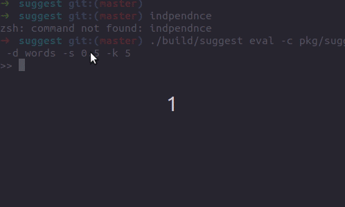
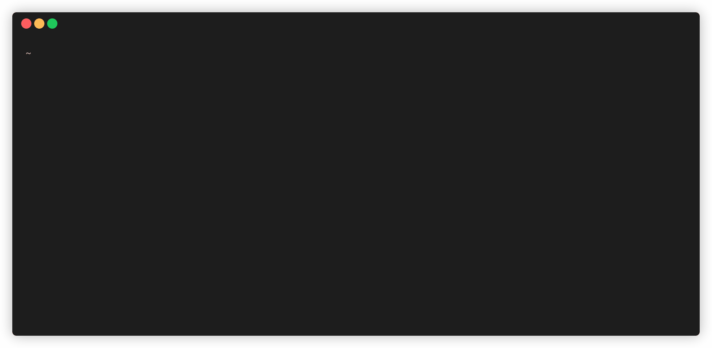

# Suggest

Library for Top-k Approximate String Matching, autocomplete and spell checking.

[](https://travis-ci.com/suggest-go/suggest)
[](https://goreportcard.com/report/github.com/suggest-go/suggest)
[](https://godoc.org/github.com/suggest-go/suggest)

The library was mostly inspired by
- http://www.chokkan.org/software/simstring/
- http://www.aaai.org/ocs/index.php/AAAI/AAAI10/paper/viewFile/1939/2234
- http://nlp.stanford.edu/IR-book/
- http://bazhenov.me/blog/2012/08/04/autocomplete.html
- http://www.aclweb.org/anthology/C10-1096

## Docs

See the [documentation](https://suggest-go.github.io/) with examples demo and API documentation.

## Demo

#### Fuzzy string search in a dictionary

The [demo](https://suggest-go.github.io/docs/demo/suggest.html) shows approximate string search in a dictionary with more than 200k English words.

You can also run it locally

```
$ make build
$ ./build/suggest eval -c pkg/suggest/testdata/config.json -d words -s 0.5 -k 5
```

or by using Docker

```
$ make build-docker
$ docker run -p 8080:8080 -v $(pwd)/pkg/suggest/testdata:/data/testdata suggest /data/build/suggest service-run -c /data/testdata/config.json
```



#### Spellchecker

In order to run spellchecker demo for language, do the next

* Download an English [language model](https://app.box.com/s/elogon8jdimqjdvfncr06b0qjngasljc) built on [Blog Authorship Corpus](http://u.cs.biu.ac.il/~koppel/BlogCorpus.htm)
* Extract downloaded language model and perform
```
$ make build
$ ./build/./spellchecker eval -c lm-folder/config.json
```



## Contributions

When contributing to this repository, please first discuss the change you wish to make via issue, email, or any other method with the owners of this repository before making a change.
